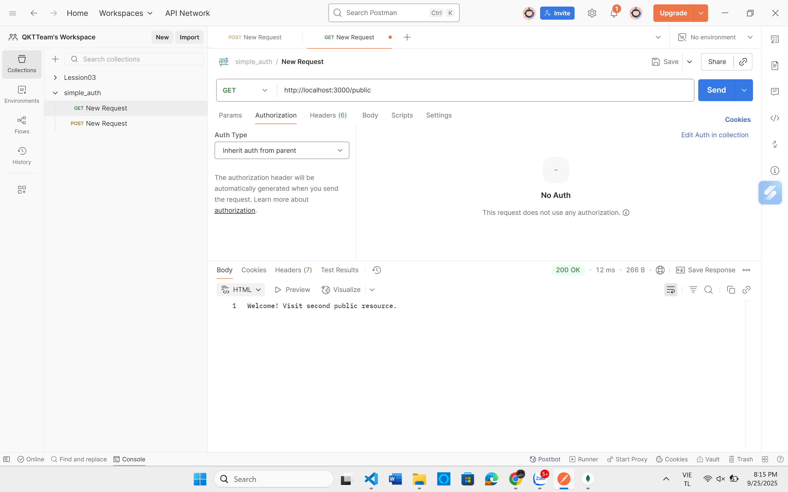

# Simple Authentication
### Mở cmd cài đặt 
- Mở cmd, chuyển đến thư mục `simple_auth`.
- Chạy lệnh:
```bash
npm install
```
## 1. Basic Auth
### Test API với POSTMAN

1. **Khởi động server:**
   - Mở cmd, chuyển đến thư mục `simple_auth`.
   - Chạy lệnh:  
     ```bash
     node basic_auth.js
     
2. **Test API với POSTMAN:**
   - Mở POSTMAN, Test các API
   - **GET /**  
      - **URL:** `http://localhost:3000/`
      - Kết quả:  
      
   - **GET /public**  
      - **URL:** `http://localhost:3000/public`
      - Kết quả: 
      
    - **GET /secure**  
      - **URL:** `http://localhost:3000/secure`
      - **Cách test:**  
        - Chọn mục **Authorization**.
        - Ở mục **Type**, chọn **Basic Auth**.
        - Nhập:
          - **Username:** `admin`
          - **Password:** `12345`
        - Nhấn **Send** request và kiểm tra kết quả trả về.
      
## 2. Cookie Auth
### Test API với POSTMAN

1. **Khởi động server:**
   - Mở cmd, chuyển đến thư mục `simple_auth`.
   - Chạy lệnh:  
     ```bash
     node cookie_auth.js
     ```
  
2. **Test API đăng nhập với POSTMAN:**
   - Mở POSTMAN, Test các API
   - **POST /login**  
     - **URL:** `http://localhost:3001/login`
     - **Body:**  
       Chọn tab **Body** → **raw** → **JSON**  
       ```json
       {
         "username": "admin",
         "password": "12345"
       }
       ```
     - **Kết quả:**  
       - Nhận được thông báo `"Logged in!"`
       - Cookie `auth_cookie_token` được tạo (xem ở tab Cookies của POSTMAN)
       - Cookie lưu vào MongoDB (database `cookieApp`, collection `cookies`)
     
   - **GET /profile**  
     - **URL:** `http://localhost:3001/profile`
     - **Kết quả:**  
      - Nếu hợp lệ:
     
      - Nếu không có hoặc cookie hết hạn:
     
   - **POST /logout**  
     - **URL:** `http://localhost:3001/logout`
     - **Kết quả:**  
     
3. **Kiểm tra cookie trong MongoDB:**
   - Mở MongoDB Compass hoặc công cụ quản lý MongoDB.
   - Truy cập database `cookieApp`, collection `cookies`.
   - Kết quả
      - Trường hợp login thành công 
   
      - Trường hợp sau khi logout
   
